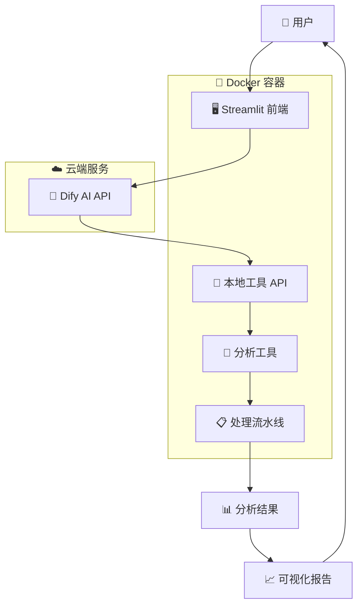

# 🧠 Monkey Brain Analysis Pipeline with Dify AI Integration

[](https://docker.com)
[](https://python.org)
[](https://streamlit.io)
[](https://dify.ai)

## 📋 项目概述

这是一个集成了 AI Agent (Dify) 的智能化猴脑影像分析平台。用户可以通过自然语言与 AI 对话来执行复杂的脑影像分析任务，无需掌握复杂的命令行操作。

### 🌟 核心特性

- **🤖 AI 驱动分析**: 通过 Dify AI Agent 自然语言交互
- **🚀 一键容器化部署**: Docker + Docker Compose 完整解决方案
- **📊 可视化界面**: 现代化的 Streamlit Web 前端
- **⚡ 并行处理**: 支持多被试并行分析，提高效率
- **📈 智能报告**: 自动生成交互式 HTML 分析报告
- **🔧 RESTful API**: 完整的 HTTP API 接口
- **🌐 云端集成**: Dify 云端 AI 服务无缝集成

### 🎯 使用场景

- **🔬 科研人员**: 批量处理脑影像数据，进行群体分析
- **👨‍⚕️ 临床医生**: 单个被试分析，辅助诊断决策
- **🎓 学生学习**: 交互式学习脑影像分析方法
- **🏢 实验室**: 标准化的分析流程和结果共享

## 🏗️ 系统架构



## 🚀 快速开始

### 🔧 环境要求

- **操作系统**: Linux/macOS/Windows
- **Docker**: 20.0+ 
- **Docker Compose**: 2.0+
- **内存**: 8GB+ 推荐
- **存储**: 20GB+ 可用空间
- **网络**: 访问 Dify API 的网络连接

### 📦 一键部署

```bash
# 1. 克隆项目
git clone <repository-url>
cd monkey_brain_segmentation_pipeline

# 2. 一键部署
./deploy.sh

# 3. 访问应用
# 前端界面: http://localhost
# API 接口: http://localhost/api
# 报告系统: http://localhost/reports
```

### ⚙️ 配置 Dify 连接

1. 访问 http://localhost
2. 在侧边栏点击 "配置 Dify 连接"
3. 填写您的 Dify 配置信息：
   ```
   API Base URL: https://api.dify.ai/v1
   API Key: your-dify-api-key
   App ID: your-dify-app-id
   ```

## 💬 使用方法

### 🗣️ 自然语言交互

直接在聊天界面与 AI 对话：

**批量分析示例**:
```
请帮我对 ION_test_monkey 数据集进行批量距离分析，
使用 midthickness 表面，生成热图和报告
```

**单个被试分析**:
```
请分析被试 001 的脑区间距离
```

**查看结果**:
```
显示最新的分析结果和报告
```

### 🔧 API 直接调用

```bash
# 健康检查
curl http://localhost/health

# 批量距离分析
curl -X POST http://localhost/distance_analysis \
  -H "Content-Type: application/json" \
  -d '{
    "work_directory": "/data/ION_test_monkey",
    "surface_type": "midthickness",
    "max_parallel_subjects": 4
  }'

# 查看任务状态
curl http://localhost/job_status/{job_id}
```

## 📊 功能模块

### 🛠️ 分析工具

1. **并行批量距离计算**
   - 多被试同时处理
   - 欧几里得和测地距离
   - 自动负载均衡

2. **单个被试分析**
   - 快速单例分析
   - 实时进度监控
   - 详细结果输出

3. **报告生成系统**
   - 交互式 HTML 报告
   - 热图可视化
   - 统计汇总

### 🎨 可视化功能

- **📈 距离热图**: 脑区间距离的直观展示
- **📊 统计图表**: 群体统计和分布分析
- **🎯 交互式报告**: 可缩放、可筛选的结果展示
- **📱 响应式设计**: 支持各种屏幕尺寸

## 📁 数据格式

### 📥 输入数据结构

```
工作目录/
├── 被试001/
│   └── anat/
│       └── sub-001_hemi-L_midthickness.surf.gii
├── 被试002/
│   └── anat/
│       └── sub-002_hemi-L_midthickness.surf.gii
└── ...
```

### 📤 输出结果结构

```
输出目录/
├── batch_distance_midthickness_L_20240815_143022/
│   ├── distance_matrices/          # 距离矩阵
│   ├── heatmaps/                   # 热图可视化
│   ├── comprehensive_analysis_report.html  # 综合报告
│   └── integrated_report.json      # 机器可读结果
```

## 🛠️ 管理和维护

### 📋 容器管理

```bash
# 查看服务状态
./deploy.sh status

# 查看日志
./deploy.sh logs

# 重启服务
./deploy.sh restart

# 停止服务
./deploy.sh stop

# 清理资源
./deploy.sh clean
```

### 🔍 监控和调试

```bash
# 运行集成测试
python test_integration.py

# 查看 API 健康状态
curl http://localhost/health

# 查看活跃任务
curl http://localhost/list_jobs
```

## 🔒 安全考虑

### 🔐 API 安全

- **认证机制**: 支持 API Key 认证
- **CORS 配置**: 跨域请求控制
- **速率限制**: 防止 API 滥用

### 🛡️ 数据保护

- **本地处理**: 敏感数据不离开本地环境
- **加密存储**: 配置信息加密保存
- **访问控制**: 基于角色的权限管理

## 📚 文档和支持

### 📖 详细文档

- [用户指南](./USER_GUIDE.md) - 完整使用说明
- [Dify 集成指南](./DIFY_INTEGRATION_GUIDE.md) - AI 集成配置
- [部署指南](./DEPLOYMENT_GUIDE.md) - 详细部署步骤
- [API 参考](./docs/API_REFERENCE.md) - 完整 API 文档

### 🔧 故障排除

常见问题解决方案：

1. **Dify 连接失败**
   ```bash
   # 检查网络连接
   curl -I https://api.dify.ai
   
   # 验证 API 密钥
   # 在 Dify 控制台检查密钥状态
   ```

2. **容器启动失败**
   ```bash
   # 查看详细日志
   docker-compose logs monkey-brain-pipeline
   
   # 检查端口占用
   lsof -i:80
   ```

3. **分析任务卡住**
   ```bash
   # 查看任务状态
   curl http://localhost/list_jobs
   
   # 重启服务
   ./deploy.sh restart
   ```

## 🤝 贡献和开发

### 💻 开发环境设置

```bash
# 安装开发依赖
pip install -r requirements.txt
pip install -r requirements-dev.txt

# 运行测试
python -m pytest tests/

# 代码质量检查
flake8 .
black .
```

### 🔄 持续集成

项目使用 GitHub Actions 进行自动化测试和部署：

- **🧪 自动测试**: 每次提交运行完整测试套件
- **🐳 Docker 构建**: 自动构建和推送 Docker 镜像
- **📊 代码质量**: 自动代码质量检查和报告

## 📊 性能优化

### ⚡ 性能特性

- **并行处理**: 支持多进程并行分析
- **内存优化**: 智能内存管理，支持大数据集
- **缓存机制**: 中间结果缓存，避免重复计算
- **异步任务**: 非阻塞式长时间任务处理

### 📈 性能监控

```bash
# 系统资源监控
docker stats monkey-brain-analysis

# 任务执行时间统计
curl http://localhost/performance_stats

# 内存使用分析
curl http://localhost/memory_usage
```

## 🎯 路线图

### 🔮 未来计划

- **🧠 更多分析工具**: 功能连接、网络分析等
- **🤖 更智能的 AI**: 更准确的需求理解和参数推荐
- **☁️ 云端计算**: 支持云端大规模并行计算
- **📱 移动端**: 移动设备友好的界面
- **🔌 插件系统**: 支持第三方工具集成

### 📅 版本计划

- **v1.1**: 增加更多可视化选项
- **v1.2**: 支持更多数据格式
- **v2.0**: 完整的云端部署方案

## 📄 许可证

本项目采用 MIT 许可证 - 详见 [LICENSE](LICENSE) 文件。

## 🙏 致谢

感谢以下项目和组织的支持：

- [Dify.AI](https://dify.ai) - AI Agent 平台
- [Streamlit](https://streamlit.io) - Web 应用框架  
- [Docker](https://docker.com) - 容器化平台
- [Flask](https://flask.palletsprojects.com) - API 框架

---

<div align="center">

**🧠 开始您的智能脑影像分析之旅！**

[🚀 立即部署](#-快速开始) | [📖 查看文档](./USER_GUIDE.md) | [💬 获取支持](mailto:support@example.com)

</div>


